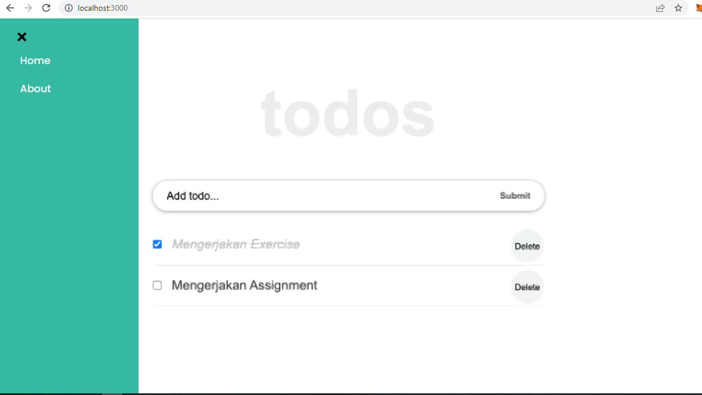
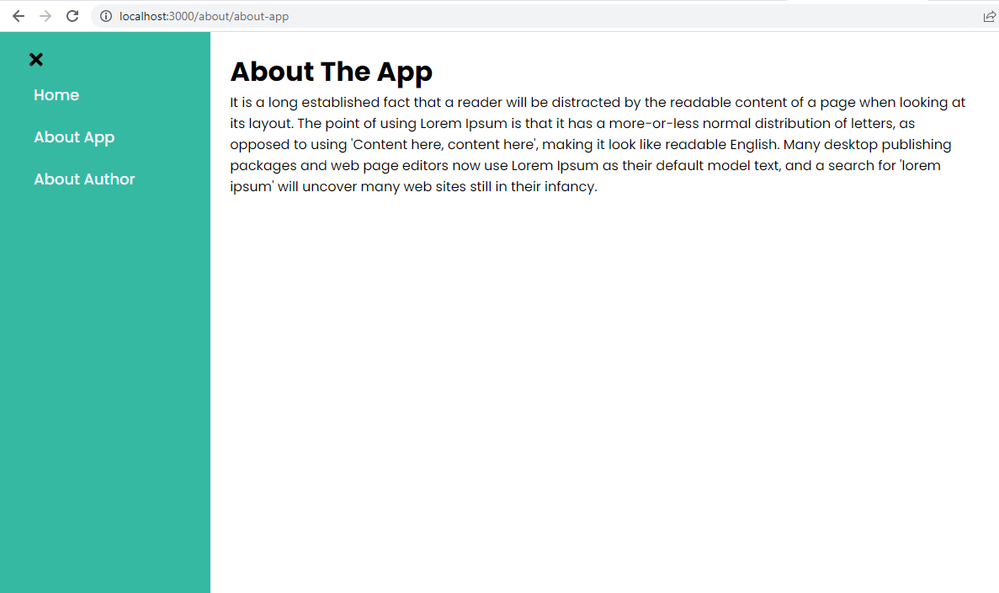

# Resume Materi React Routing

## Apa itu Router
Router merupakan modul dalam react yang berfungsi untuk melakukan proses navigasi pada Single Page Application atau disingkat SPA. Perbedaan Multi Page Application dengan Single Page Aplication adalah jenis aplikasi website dimana perlu memuat ulang seluruh halaman setiap kali web membuat permintaan baru sedangkan Single Page Application satu halaman yang menangani aktivitas tersebut.

### React Router 
Routing yang dipakai di react biasanya menggunakan react-router-dom karena router terpisah dari modul corenya maka perlu diinstal modul tersebut dengan menuliskan diterminal

        npm install react-router-dom --save

Dalam react router terdapat 
* BrowserRouter : sebagai router yang menggunakan API History dari HTML 5 untuk singkronkan UI dengan url dari penggunaan location
* Switch : digunakan untuk membungkus Route
* Route : untuk pengarah jalannya lalu lintas suatu aplikasi web
* Link : digunakan untuk berpindah halaman

## Menggunakan Url param pada React
Url paramater adalah suatu parameter yang nilainya ditetapkan dinamais di url halaman. memungkinkan rute untuk merender komponen yang sama saat meneruskan komponen tersebut kebagian dinamis dari URL, sehingga dapat mengubah data nya menggunakan parameter

            <Route exact path="kelas/:id" component={KelasDetail} />

pada kode tersebut terdapat param :id yang menandakan itu dalah sebuah id sebagai parameternya, dalam react untuk menangkap sebuah param dalam Class menggunakan this.props.match.params adapun link berguna seperti tag a pada html yaitu berpindah sesuai link yang diberikan contoh pada react dapat ditulis dimana link tersebut akan berpindah ke halaman profil

            <Link to="/profil">Menuju Profil</Link>

## Hook Routing React
terdapat 4 Hook Routing React yaitu 
* useHistory : akses ke instance riwayat yang digunakan untuk bernavigasi
* useParams : untuk mengakses match.params 
* useRouteMatch : mencocokan url 
* useLocation 

## Tugas 
[Link Tugas](praktikum/my-task/)

