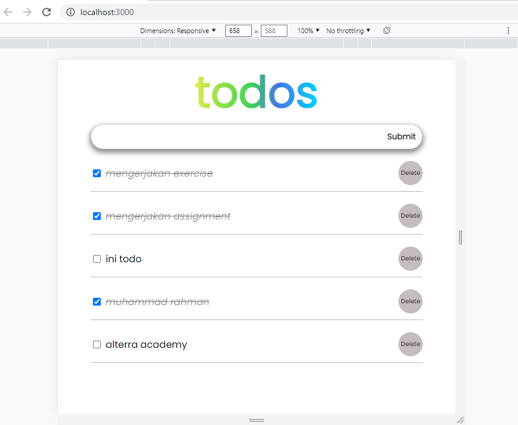

# Resume Materi React Hook

## React Hook

Hooks merupakan fitur baru di React 16.8. Dengan Hooks, menggunakan state dan fitur React yang lain tanpa perlu menulis sebuah kelas. Dengan hooks dapat mampu menggunakan fitur react kelas

Hooks Dasar Pada React

- useState
- useEffect
- useContext

Hooks Tambahan

- useReducer
- useCallback
- useMemo
- useRef
- useImperativeHandle
- useLayoutEffect
- useDebugValue

Aturan Pada Hooks

Hooks hanya dipanggil pada tingkat atas jangan memanggil hooks dalam lopp,conditions, atau nested funtion. kita dapat memanggil hooks dari komponen-komponen fungsi react dan memanggil hooks dari custom hooks.

## Menggunakan useState dan useEffect

Pada materi sebelumnya menggunakan kelas untuk mendeklarasikan state kita harus menulis this.state dan untuk mengupdate state kita harus menggunakan this.setState pada react hooks penggunaan state lebih mudah kita hanya perlu menuliskan const[state. setState] = useState(0) dengan menuliskan seperti itu kita sudah mendeklarasikan bahwa state tersebut bernilai 0 sedangkan jika kita ingin mengupdate state tersebut kita hanya menuliskan setState(1) dan state tersebut terupdate menjadi 1.

Sedangkan untuk useEffect pada kelas sebelumnya kita menggunakan componentDidMount, componentDidUpdate, dan componentWillUnmount dan pada react Hook ini semuanya tersebut terdapat dalam satu yaitu useEffect() pada useEffect kita memberikan 2 paramater yang pertama callback dan kedua dependency ditulis seperti ini useEffect(()=>{},[])

## Custom Hooks

Dengan custom hooks kita bisa membuat hook sendiri dengan mengekstrak komponen logika ke fungsi yang dapat digunakan lagi.

# Tugas

[Link Tugas](praktikum/my-task/)

