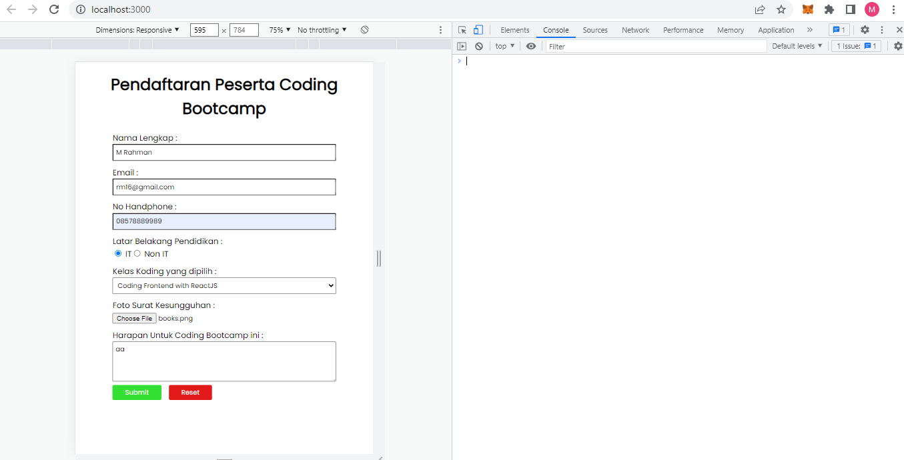
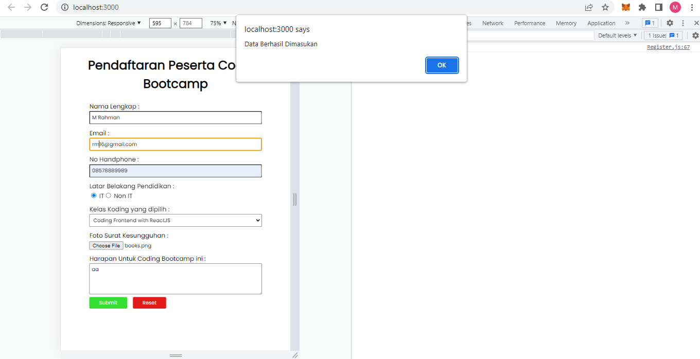
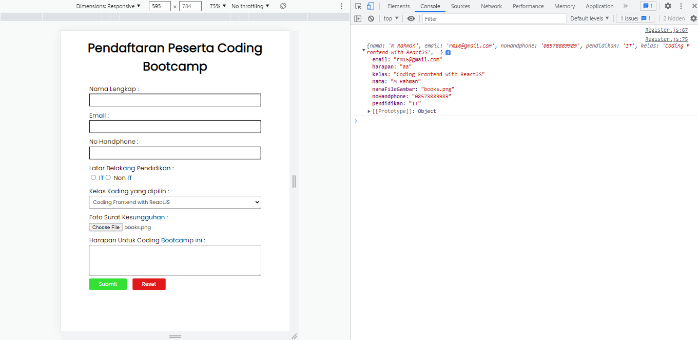
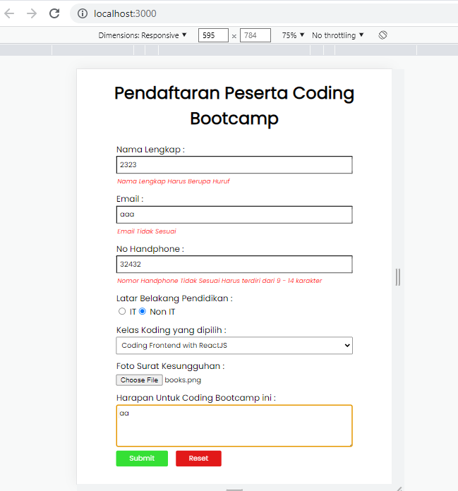
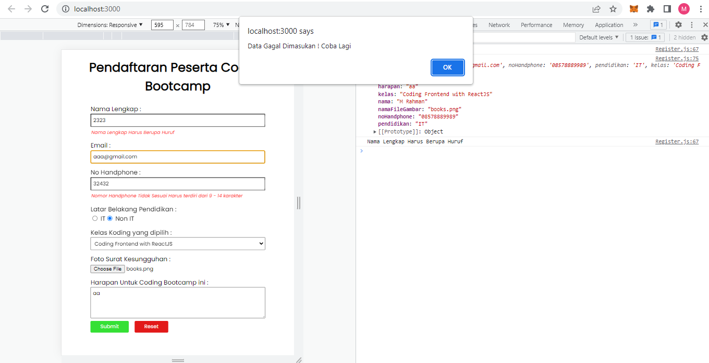

# Resume Materi React Form

## Form

Form dapat digunakan untuk menghandle inputan dari user. Form banyak dijumpai saat login, mendaftarkan sesuatu, memberikan feedback, mengisi data dan masih banyak lainnya. Terdapat beberapa macam form diantaranya tag input, texarea, dan select sedangkan dalam input terdapat macam input yang sering digunakan penggunaan dengan memasukan salah satu type pada atribu type di input yaitu :

- `<input type="text">` text (default)
- <input type="text">
- `<input type="button" value="button">` button
- <input type="button" value="button">
- `<input type="color">` color
- <input type="color">
- `<input type="checkbox">` checkbox
- <input type="checkbox">
- `<input type="date">` date
- <input type="date">
- `<input type="email">` email
- <input type="email">
- `<input type="file">` file
- <input type="file">
- `<input type="hidden">` hidden
- <input type="hidden">
- `<input type="month">` month
- <input type="month">
- `<input type="number">` number
- <input type="number">
- `<input type="password">` password
- <input type="password">
- `<input type="radio">` radio
- <input type="radio">
- `<input type="reset">` reset
- <input type="reset">
- `<input type="submit">` submit
- <input type="submit">
- `<input type="url">` url
- <input type="url">

## Controlled dan Uncontrolled Component

Controlled Component adalah sebuah input yang menggunakan pendekatan react biasanya dalam input terdapat state dimana dalam component inputnya menyimpan state dalam merender input yang artinya komponen tersebut dapat merespon perubahan input dengan segera. contoh digunakan dalam umpan balik ditempat seperti validasi. Sedangkan untuk Uncontrolled Component adalah input yang tidak terkontrol seperti input html tradisional dimana saat disubmit nilai dari field akan diambil dimana berbeda dengan controlled component data sebelum disubmit atau dalam proses input data sudah tersimpan di state.

## Basic Validation

Terdapat 3 alasan mengapa validasi form diperlukan :

- Mencari input data yang benar dan sesuai format. Sebuah web/aplikasi tidak dapat berjalan dengan benar, jika data yang diolah tidak sesuai dengan kebutuhan aplikasi
- Melindungi akun pengguna. Misalnya, membuat pengguna untuk memasukkan data password yang aman
- Melindungi sistem/aplikasi. Validasi form yang kuat dapat meminimalisir perilaku pengguna yang ingin meretas sistem/aplikasi

Terdapat 2 jenis validasi

1. Validasi sisi klien, terbagi atas dua bagian

- Built-in form validation, yaitu menggunakan fitur validasi langsung dari HTML5. Biasanya, validasi ini tidak membutuhkan Javascript dan memiliki performa yang lebih baik. Tapi tidak dapat dikostumisasi. Kadang pesan errornya cukup ‘kaku’. Contohnya : required, minlength, maxlength, min, max, type dan patten
- Menggunakan Javascript. Ini membuat validasi form dapat dikostumisasi. Tetapi kita perlu membuatnya sendiri.

2. Server side Validation

- Validasi yang dilakukan pada sisi server. Sisi server bertugas untuk memvalidasi data kembali, sebelum disimpan di database. Jika ditemukan kesalahan, maka response akan dikirim kembali ke client berupa koreksi atas kesalahan yang dibuat oleh pengguna.

- Berbeda dengan validasi sisi klien, validasi ini tidak user-friendly. Karena, koreksi kesalahan akan dikirimkan, setelah form di-submit.

Built Form Validation pada form yaitu required, minlength dan maxlength, min dan max, pattern, dan type terdapat banyak pilihan untuk type biasanya sering digunakan ada password, number, email, dan text. Dan yang terakhir adalah menggunakan Javascript

## Tugas

[Link Tugas](praktikum/my-task/)  

- Data Dimasukan
  
- Alert Berhasil Yang Tampil
  
- Data Tersimpan ditampilkan di Console
  
- Validasi input Tidak Sesuai
  
- Alert Gagal Yang Ditampilkan
  
