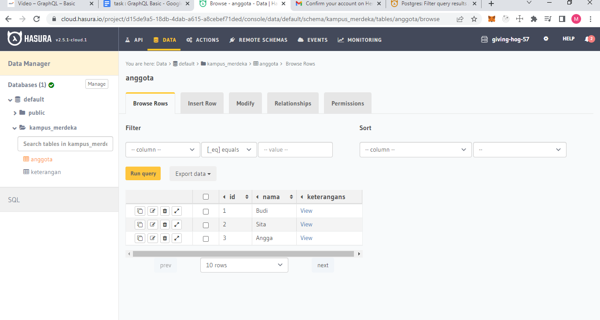
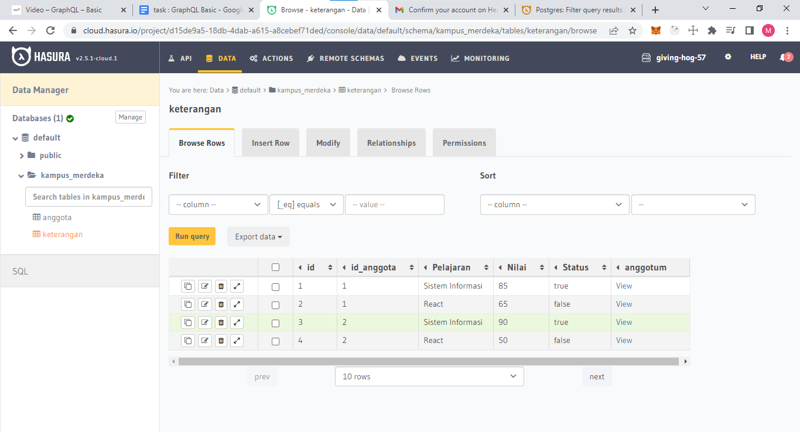
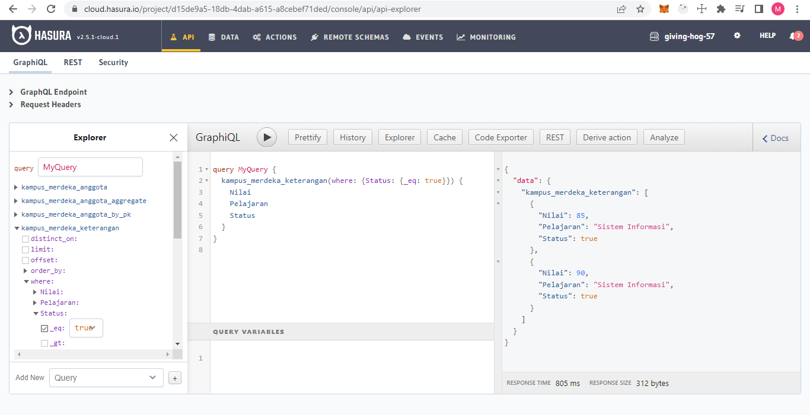
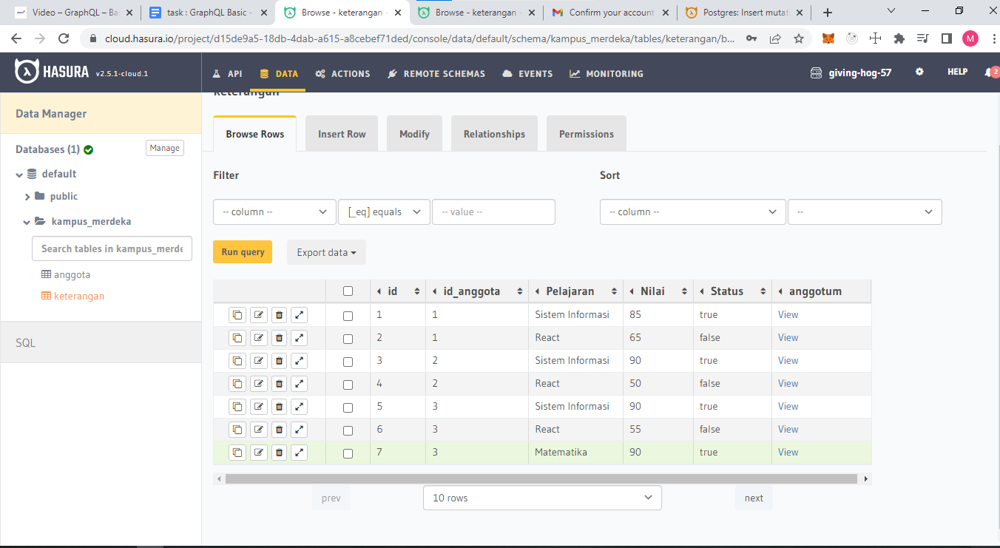

# GraphQL - Basic

## Graphql

Graphql adalah query language (bahasa query) untuk API. Berbeda dengan REST API biasa, kita akan punya struktur yang lebih jelas dan membuat lebih fleksibel untuk dikonsumsi oleh client nantinya. Kita persiapkan juga server nodenya untuk menampilkan bagian graphqlnya nanti.

## Fitur Utama Pada GraphQL Client

Terdapat 3 fitur Utama GraphQl CLient

1. Query : mengambil data berdasarkan spesifik qury yang telah ditetapkan
2. Mutation : memasukan, menghapus, dan edit data
3. Subscription : mengambil update setiap waktu berdasarkan sebuah peristiwa

## Keuntungan Graphql

Secara umum kegunaan GraphQL adalah sebagai pengganti REST API dengan kelebihan dapat mengakses semua data yang di kirim oleh Backend dan Frontend bisa mengakses seluruh data dalam satu endpoint.

Struktur GraphQl
`{ query{ movies{ id title } } }`
Hasil
`{ movies : { "id" : 1, title: Car } ] }`

## Task GraphQL

### Membuat Tabel Anggota

### Membuat Tabel Keterangan

### Query Tabel Keterangan Status True

### Memasukan Data

### Hasil Akhir

