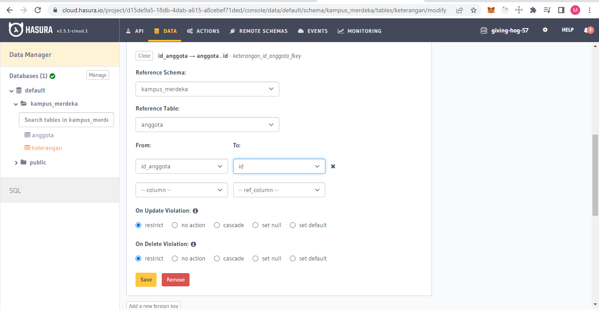
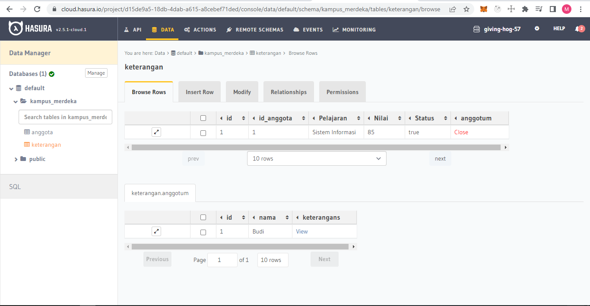
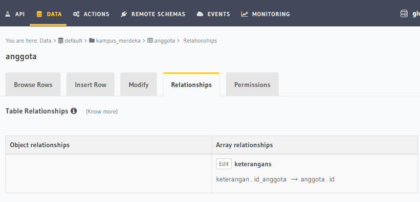
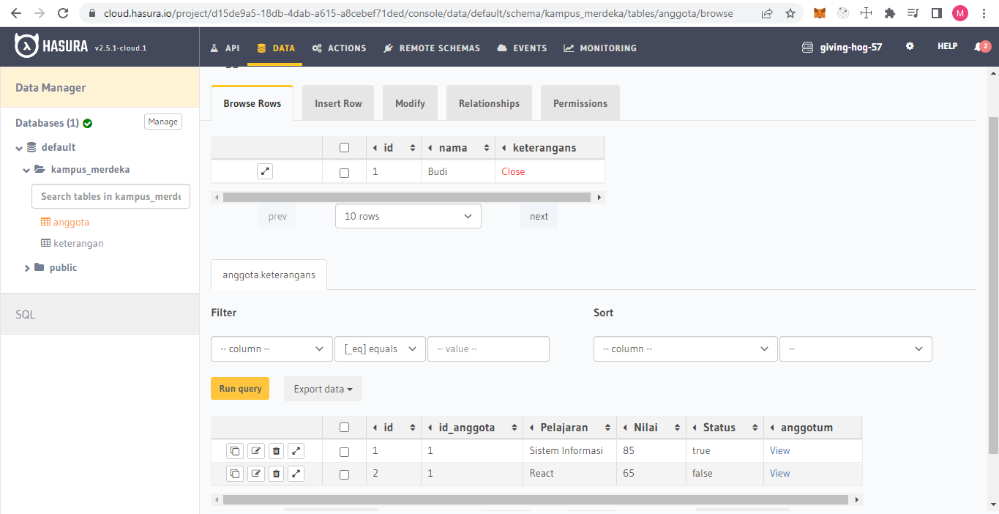

# Relational Database

## Database

Database adalah Sekumpulan data yang terorganisir. dalam database terdiri dari beberapa tabel yang terdiri dari beberapa atribut misal firstname, lastname, date, address, numberphone. dan lain lain. setiap atribut tersebut memiliki tipe data masing-masing diantaranya varchar, integer, boolean, date, dan lainnya. Terdapat software yang menggunakan Relational Database Model sebagai dasarnya contohnya MySQL. Dalam database terdapat beberapa jenis relational diantaranya

- one to one : hubungan antar tabel satu ke satu tabel database
- one to many : hubungan antar tabel satu ke lebih dari satu tabel database
- one to many : hubungan antar tabel lebih dari satu ke lebih dari satu tabel database

## DDL (Data Definition Language)

Contoh DDL Statement

- CREATE DATABASE database_name;
- CREATE TABLE ...
- DROP TABLE ...
- RENAME TABLE ...

Contoh Membuat tabel articles yang terdiri dari beberapa properties:

`CREATE TABLE articles( id int NOT NULL, title text NOT NULL, content text NOT NULL, rating int NOT NULL, author_id int NOT NULL, PRIMARY KEY (id) );`

## DML (Data Manipulation Language)

Perintah yang digunakan untuk memanipulasi data dalam tabel dari suatu database. Statement Operation dalam meamanipulasi diantaranya :

- INSERT : Menambahkan Data
- SELECT : Membaca Data
- UPDATE : Mengedit data
- DELETE : Menghapus data

# Task

;  
; 
; 
; 
