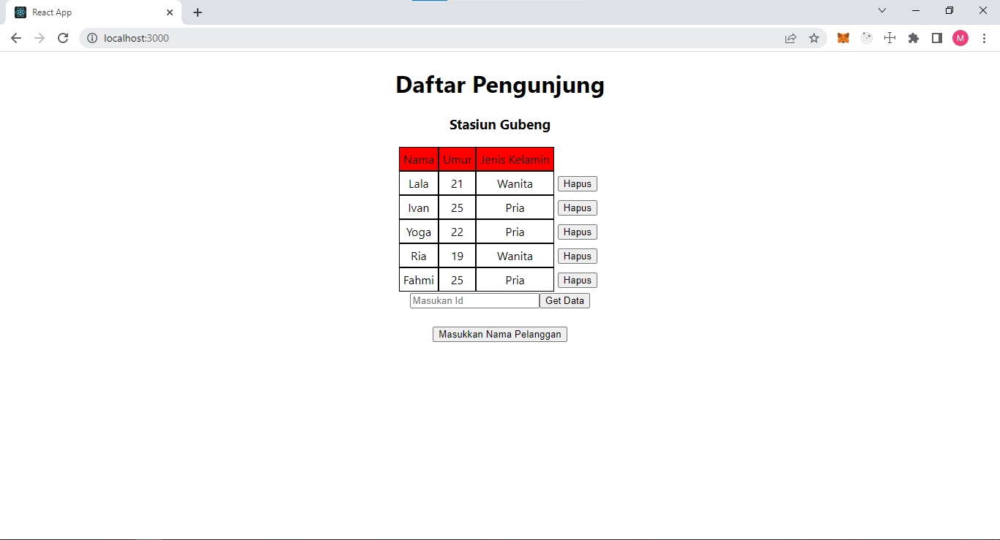
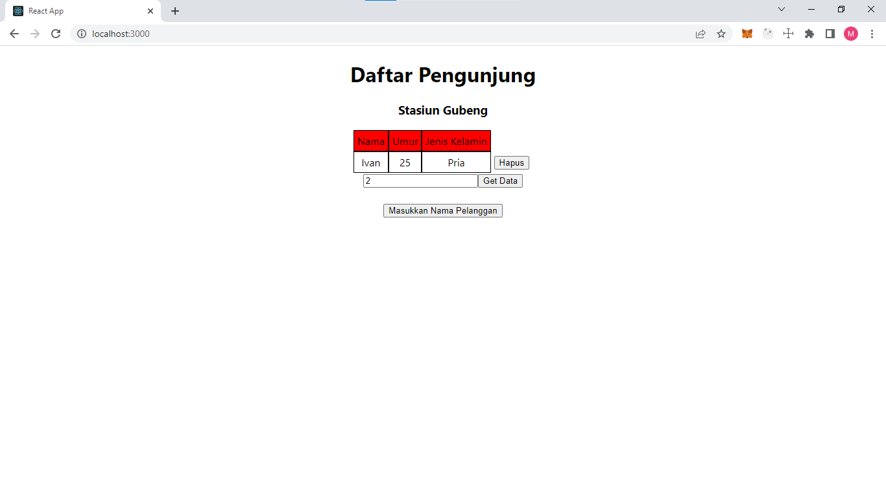

# GraphQL - Query and Apollo Client

## Apollo Client

Apollo Client adalah sebuah library state manajemen komprehensif untuk JavaScript yang memungkinkan mengelola data lokal dan jarak jauh dengan GraphQL. digunakan untuk mengambil, menyimpan, dan memodifikasi data aplikasi, sambil memperbarui UI secara otomatis.

## Apollo Setup

Pada React

1. install graphql dan apollo client dengan npm install @apollo/client graphql
2. Inisialisasi ApolloClient dengan cara

- `import {
  ApolloClient,
  InMemoryCache,
  ApolloProvider,
  useQuery,
  gql
  } from "@apollo/client";

- const client = new ApolloClient({
  uri: 'https://48p1r2roz4.sse.codesandbox.io',
  cache: new InMemoryCache(),
  headers: {
  "x-hasura-admin-secret":"123456778",
  }
  });`

* render(
  `<ApolloProvider client={client}>`
  `<App />`
  ` </ApolloProvider>`, document.getElementById('root'), );

## UseQuery dan UseLazyQuery

- UseQuery
  useQuery React Hook adalah API utama untuk mengeksekusi kueri dalam aplikasi Apollo. Untuk menjalankan kueri dalam komponen React, memanggil useQuery dan memberikan string kueri GraphQL. Saat komponen dirender, useQuery mengembalikan objek dari Apollo Client yang berisi loading, error, dan data properti yang dapat gunakan untuk merender UI Anda.

- UseLazyQuery
  UseLazyQuery mengeksekusi kueri sebagai respons terhadap peristiwa selain rendering komponen. useLazyQuery ini menjalankan kueri sebagai respon terhadap peristiwa misalnya tombol diklik

## Task

Pada Task ini digunakan useQuery Untuk menampilkan seluruh data dan useLazyQuery menampilkan data ketika tombol Get Data diklik

