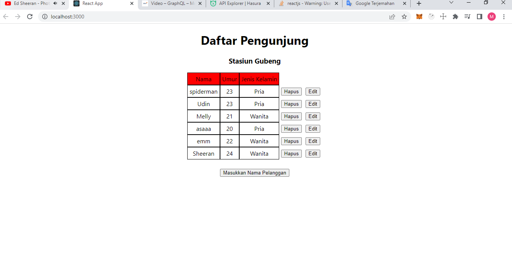
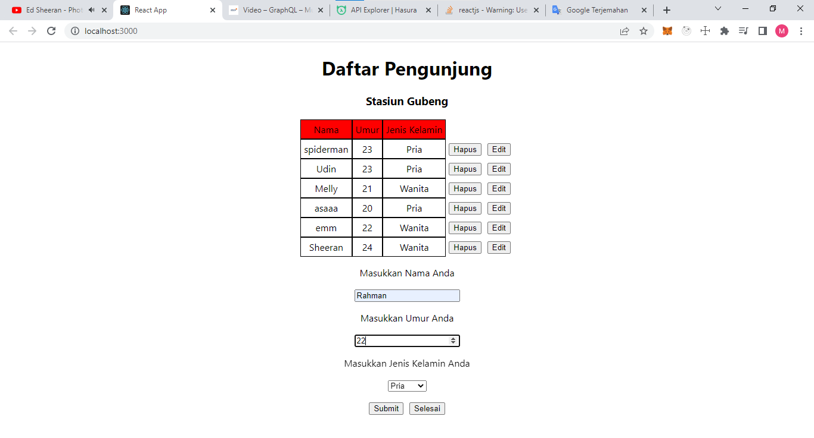
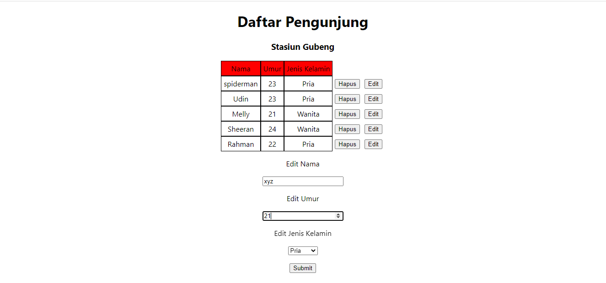
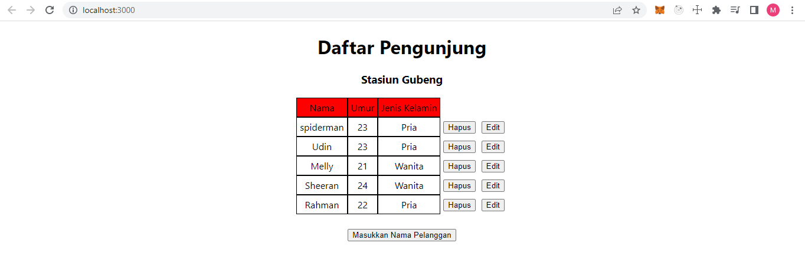
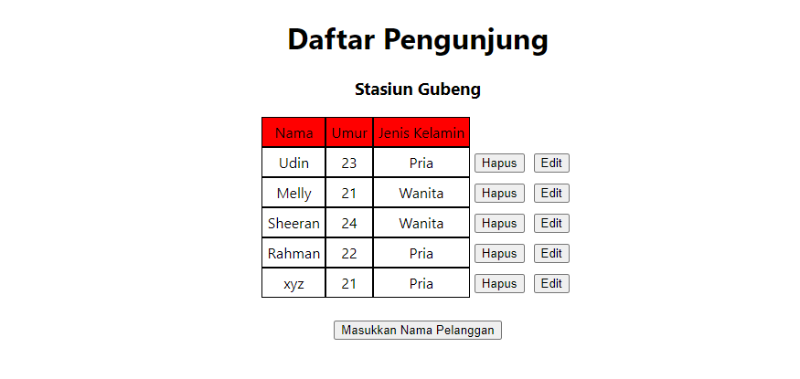

# GraphQL - Mutation

## Mutation

Mutasi memungkinkan untuk memodifikasi data sisi server, dan juga mengembalikan objek berdasarkan operasi yang dilakukan. dapat digunakan untuk menyisipkan (Insert), memperbarui (Update), atau menghapus (Delete) data.

## Insert

Pada Graphql Mutation untuk Insert Data Pada mutasi ini menyisipkan data nama, umur, dan jenis kelamin dengan mengirimkan sebuah argumen data objek :

`mutation MyMutation($object: task22_pengunjung_insert_input = {}){ insert_task22_pengunjung_one(object: $object) { nama umur jenisKelamin } }`
Data Object yang dikirimkan :

`{ object: { nama : "Rahman", umur : 21, jenisKelamin:"Pria" } }`

## Update

Pada Graphql Mutation untuk Update Data Pada mutasi ini menyisipkan id sebagai penandanya dan mengirimkan sebuah argumen data berupa berupa objek :

`mutation MyMutation( $id: Int_comparison_exp = {} $_set: task22_pengunjung_set_input = {}) { update_task22_pengunjung(where: { id: $id }, _set: $_set) { affected_rows } }`

Data Object yang dikirimkan :
`{ id: { _eq: 2, }, _set: { nama : "Ron", umur : 19, jenisKelamin:"Pria" } }`

## Delete

Pada Graphql Mutation untuk Delete Data Pada mutasi ini hanya mengirimkan id sebagai parameter untuk data yang akan dihapus :
`mutation MyMutation($_eq: Int!) { delete_task22_pengunjung(where: { id: { _eq: $_eq } }) { affected_rows } }`

Data id yang dikirimkan
`{ _eq: 2, }`

## Task

Pada Task ini menambahkan fitur Insert, Delete, dan Update Pada Projek Sebelumnya

### Data Awal

### Insert Data

### Update Data

### Delete Data

### Hasil Akhir

