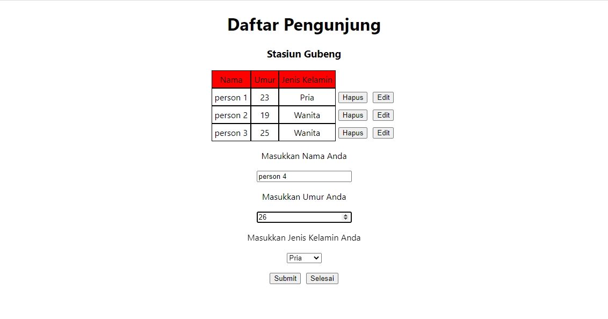
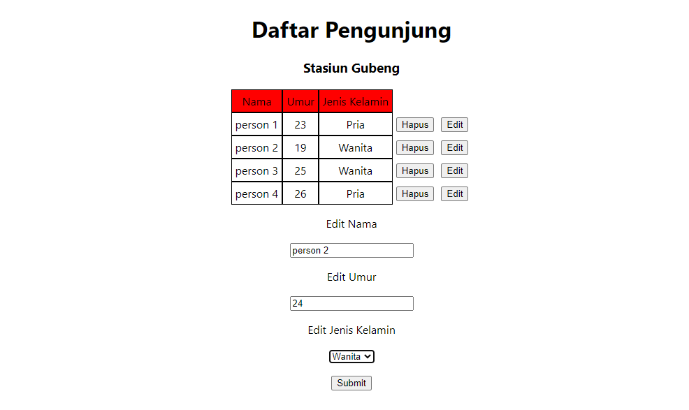
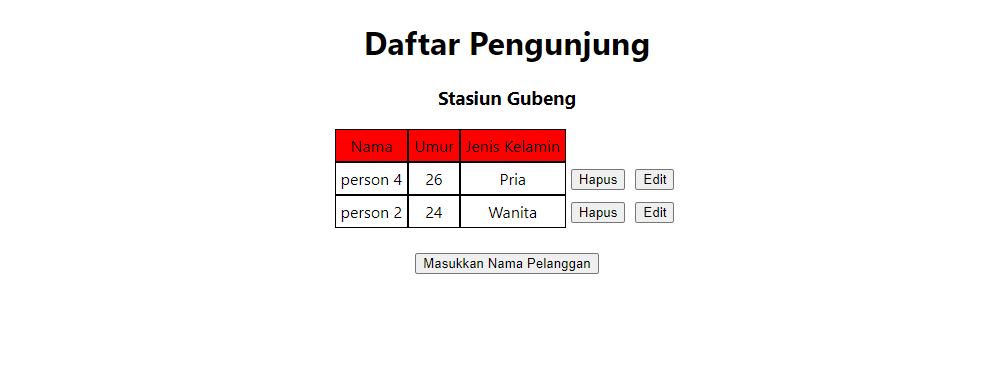
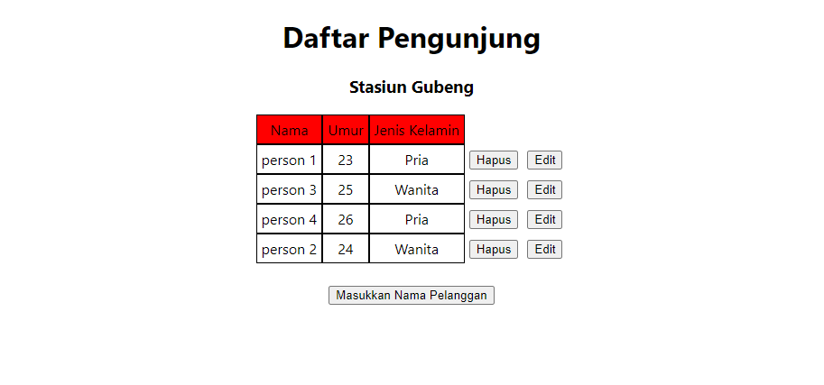

# GraphQL - Subscription

## Subscription

Selain Queri dan Mutation graphql juga terdapat Subscribe yang berguna untuk memberi tahu klien secara real time tentang perubahan data pada back-end, seperti pembuatan data baru, ataupun updata data.

## Graphql Subscription

Pada Graphql untuk melakukan Subscription adalah dengan mensetting pada kode kita modul yang dibutuhkan seperti menginstall apollo client, dan modul subscription dan mengimport gql agar bisa menggunakan query mutation dan subscription.

Sedangkan pada graphql sendiri untuk melakukan subscription hanya perlu mengambil data apa yang akan di subscribe contoh disini data id, nama, umur, dan jenis kelamin.

`subscription MySubscription { task22_pengunjung { id nama umur jenisKelamin } }`

## useSubscription dan subscribeToMore

untuk melakukan subscription terdapat dengan cara proses useSubscription dan subscribeToMore pada query dikarenakan tergantung server mengembalikan data ada yang semua data yang dikembalikan dan ada hanya mengembalikan data update nya saja jika semua data yang dikembalikan maka bisa menggunkan useSubscription sedangkan untuk server yang mengembalikan data update nya menggunakan subscribeToMore

1. useSubscription

- import modul yang dibutuhkan
  `import { gql, useSubscription } from "@apollo/client";`

- Membuat variabel SubscriptionData dari graphql untuk subscription
  `const SubscriptionData = gql subscription MySubscription { task22_pengunjung { id nama umur jenisKelamin } } ;`

- Menggunakan Subscription pada React untuk mengambil data, loading, dan error
  `const { data: respond, loading, error } = useSubscription(SubscriptionData);`

2. subscribeToMore

Pada subscribeToMore ini dibuatkan hook untuk useGetData sehingga seperti ini untuk lebih lengkapnya terdapat pada folder praktikum

- import modul yang dibutuhkan
  `import { useQuery } from "@apollo/client"; import { getData } from "../graphql/query"; import { SubscriptionData } from "../graphql/subscribe";`

- Membuat function untuk getData yang terdapat subscription
  `export default function useGetData() {`
  `const { data: respond, loadingGetData, subscribeToMore } = useQuery(getData); `
  `const subscribeData = () => {`
  `subscribeToMore({ document: SubscriptionData,`
  `updateQuery: (prev, { subscriptionData: { data: respond } }) => { return respond; }}) }`

  `return { respond: respond ? respond.task22_pengunjung : [], loadingGetData, subscribeData, }} `

- Menggunakan Subscription pada React untuk mengambil respond, loadingGetData, dan subscribeData
  `const { respond, loadingGetData, subscribeData } = useGetData();`

## Task

Pada Task ini menambahkan subscription

### Insert Data

### Update Data

### Delete Data

### Hasil Akhir

