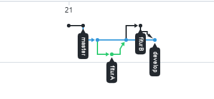

# Resume Materi GIT 

Dalam materi ini mempelajari

## 1. Proses alur penyimpanan perubahan pada GIT

Setiap Program atau code pasti akan selalu mengalami versi pembaruan dalam pengembangannya oleh karena itu
terdapat tools dalam mengatur versi dari source code program yang mana salah satunya yang populer adalah GIT
yang digunakan developer untuk mengembangkan software secara bersama-sama GIT ini terdistribusi dimana code program yang asli tersimpan diserver atau disimpan di github sebagai git hosting service yang mana dengan git kita bisa mengakses nya secara lokal.

Untuk proses alur penyimpanan perubahan pada git adalah 
* Membuat repositori terlebih dahulu di github 
* lalu folder yang dilokal dimana yang akan diupload di github di inisialisai terlebih dahulu dengan menuliskan $git init pada git
* Setiap perubahan dilokal harus di $git add . supaya tersimpan di stagging area setelah itu di commit dengan menuliskan $git commit -m "pesan perubahannya"
* kemudian di push dengan menuliskan $git push maka folder yang di lokal akan terupload ke dalam github dengan perubahan yang telah dibuat

## 2. Branch

branch atau percabangan adalah sebuah cabang dimana bila kita ingin menambahkan fitur tanpa harus ditulis di master melainkan membuat sebuah cabang baru agar proses nya rapi tidak tumpang tindih yang mana setelah kode yang dibuat fix tidak ada perubahan maka akan di merge dengan master 

## 3. Alur kerja dalam berkolaborasi dalam GIT

untuk alur kerja dalam git lebih baik dan rapi terbagi dalam beberapa branch master, develop, dan sebuah fitur yang ingin ditambahkan. Dimana sebuah master adalah hasil akhir yang sudah final tidak ada perubahan sedangkan untuk develop merupakan hasil dari gabungan beberapa fitur yang telah dibuat branch yang yang memungkinkan ada perubahan.

# TASK 

[link github untuk task pada materi git](https://github.com/rahmanmue/praktikum-github)

