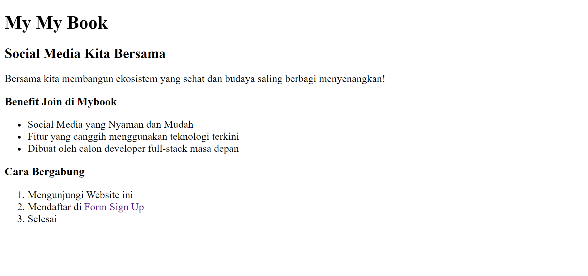
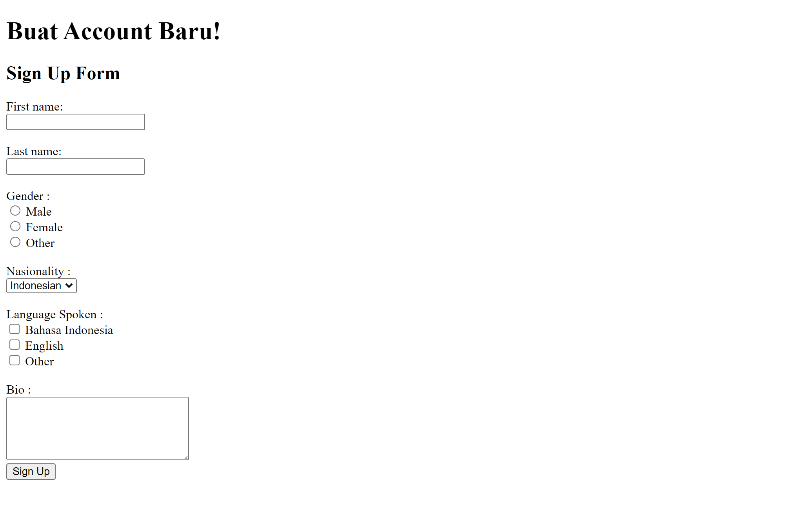
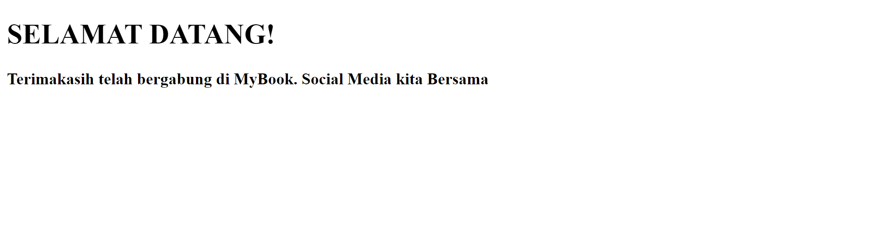

# Resume Materi HTML

Dalam materi HTML ini mempelajari :

## Apa itu HTML

HTML yang merupakan singkatan dari Hypertext Markup Language adalah sebuah standar yang digunakan 
secara luas untuk menampilkan halaman web. Kegunaan HTML sendiri adalah :

* Membuat struktur dari halaman website
* Mengatur tampilan dan isi halaman web
* Membuat tabel dengan tag html table
* Membuat form HTML
* Membuat gambar dengan canvas
* Mempublikasikan halaman secara online

## Struktur HTML
```<!DOCTYPE html>
<html>
<head>
    <title>Judul Halaman</title>
</head>
<body>
   <div>
        Content HTML
   </div>
</body>
</html>
```
* ```<!DOCTYPE html>``` mendefinisikan dokomen sebagai HTML 5
* ```<html>``` elemen root dari halaman HTML
* ```<head>``` berisi informasi meta tentang dokumen
* ``` <title>``` menentukan judul dokumen
* ``` <body> ``` berisis konten halaman yang terlihat

## Tag HTML

*  Heading dibagi dari heading 1 sampai 6 semakin besar heading nya maka huruf nya semakin kecil 
  ```
  <h1>Heading 1</h1> 
  <h2>Heading 2</h2> 
  <h3>Heading 3</h3> 
  <h4>Heading 4</h4> 
  <h5>Heading 5</h5>
  <h6>Heading 6</h6>
  ```

* Tag paragraph pada html
``` 
<p> Ini Paragraph</p>
``` 
* Tag link pada HTML link diisikan pada href
```
<a href="https://goggle.com">Google</a> 
``` 
* Tag gambar nama gambar diisikan pada src
 ``` 
 
 ```
* Tag list HTML terdiri dari ```<ul>``` unordered list list yang tidak terurut dan ```<ol>``` ordered list list yang terurut dimana setiap isi dari list nya menggunakan ```<li>```
 
 ``` 
  <ol>
    <li>List 1 <li>
  </ol>
  
  <ul>
    <li>List 1 <li>
  </ul>
  
  ```
  
## Tugas HTML

[Link Tugas HTML](praktikum)

### Index


### Form


### Welcome

