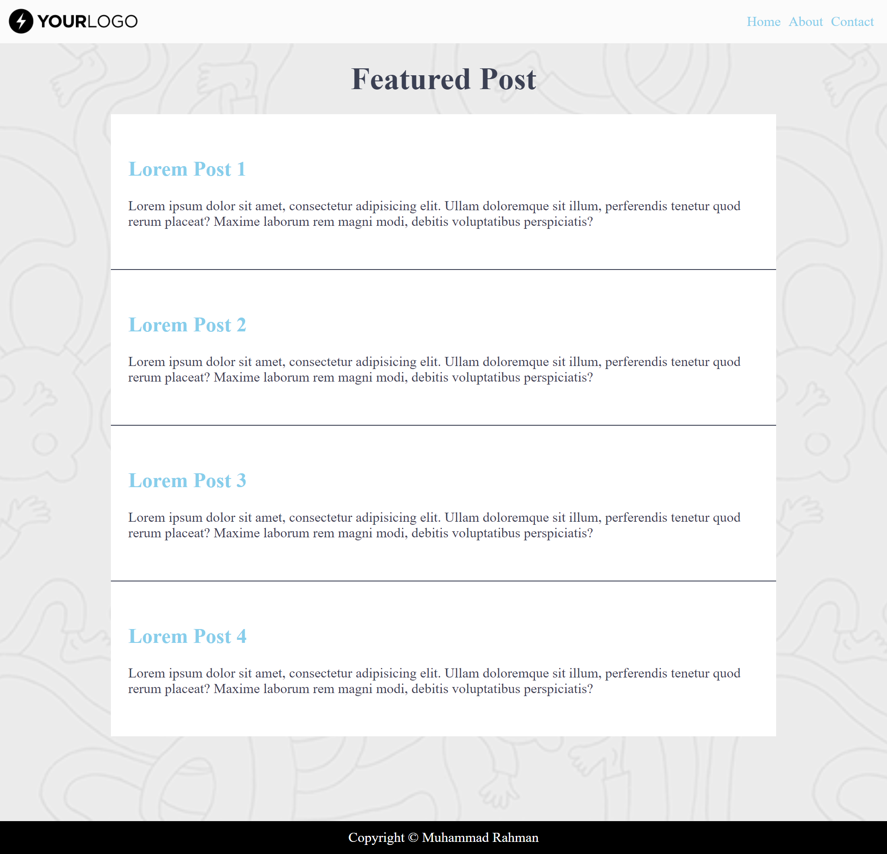

# Resume Materi CSS

Dalam materi CSS ini mempelajari :

## Apa itu CSS

CSS merupakan singkatan dari Cascading Style Sheet. Fungsi css sendiri adalah untuk menghias halaman website baik itu warna, background, lebar, tinggi dan juga dapat mengatur layout atau posisi konten dari halaman website itu sendiri. Untuk menghubungkan css dengan html ada 3 cara yaitu 

* External : Terdapat file CSS sendiri sehingga nantinya didalam file HTML dihubungkan dengan file CSS tersebut
* Internal : CSS dalam satu file yang berada di HTML yang dibungkus dalam tag ```<style>``` 
* Inline   : CSS dalam tag html langsung dituliskan dengan menambahkan atribut style

Syntax CSS ditulis seperti berikut 

    h1 {color:white;}
* h1 sebagai selector
* color sebagai properti
* white sebagai value

## CSS Selector

CSS selector adalah pola yang digunakan untuk memilih element yang ingin di styling. yang mana merupakan penanda pada HTML ke dalam CSS terdapat dua selector untuk yaitu ID dan Class

* ID (#) pada HTML ditambahkan atribut id sehingga untuk menangkap id dalam css nya menggunakan # contoh :

  ```
  <p id="paragraph">Ini Paragraph</p>
  ```

  Dalam css untuk menangkap id tersebut dengan tanda #

  ```
  #paragraph{
      color:white;
  }
  
  ```
    Otomatis hasilnya paragraph tersebut berwarna putih

* Class (.) sama seperti ID ditambahkan atribut class dalam tag HTML nya lalu ditangkap dengan CSS dengan tanda contoh :
    ```
    <p class="paragraph">Ini Paragraph</p>
    ```
    Dalam css untuk menangkap class tersebut dengan tanda . 
    ``` 
    .paragraph{
        color:white;
    }
    
    ```

## Properti CSS

CSS sendiri memiliki banyak properti disini ada beberapa properti css yang sering digunakan 

  ### Display
  
  Dalam css terdapat 3 display yaitu block, inline, dan none
  * block elemen yang selalu dimulai pada baris baru 
  * inline-block elemen yang membutuhkan lebar sesuai yang diperlukan
  * none menyembunyikan elemen 

  ### Margin dan Padding
  
  Dalam css untuk mengatur jarak atau membuat ruang disekitar elemen dengan cara margin dan padding
  * Margin mengatur ruang atau jarak antar elemen dari luar atau jarak dari border konten ke border konten lainnya
  * Sedangkan Padding mengatur ruang atau jarak suatu elemen dari dalam atau jarak dari border kedalam konten itu sendiri 

 ### Backgorund

 Dalam css untuk mengatur background suatu elemen baik itu mengganti warna atau mengganti dengan gambar dengan menggunakan properti background
    * Background-color      : mengganti warna background suatu elemen
    * Backgrounf-image      : mengganti background elemen dengan gambar
    * Background-repeat     : menentukan gambar background untuk diulang
    * Background-size       : menentukan ukuran gambar pada untuk background
    * Background-position   : mengatur posisi awal gambar background


  
## Tugas CSS

[Link Tugas CSS](praktikum)

### File1


### File2

