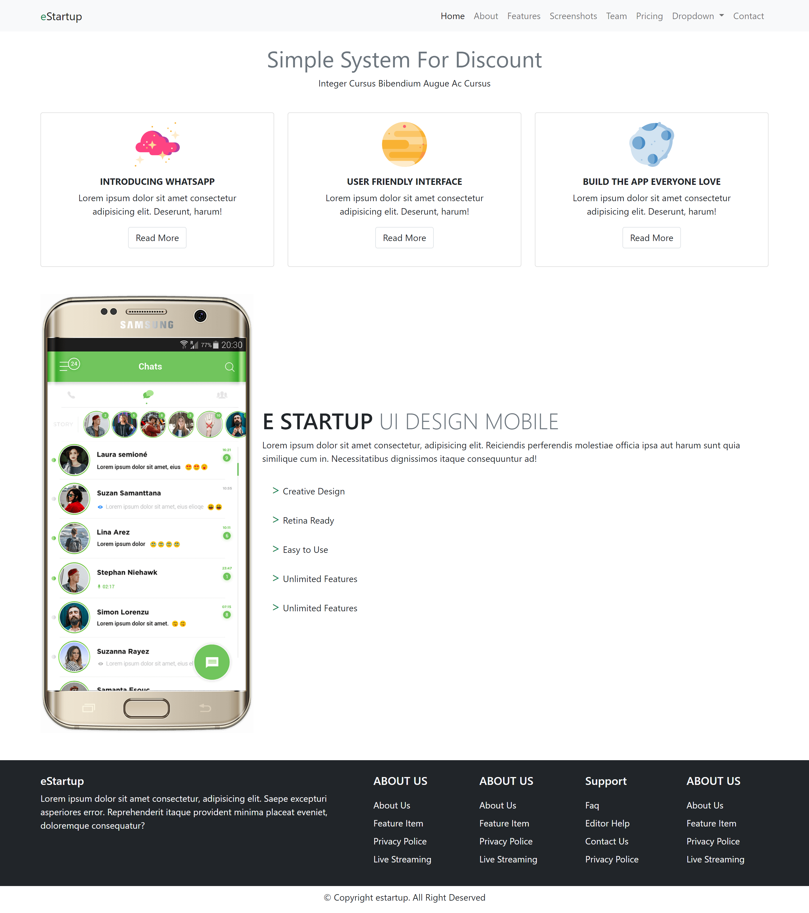

# Resume Materi Bootstrap

Dalam materi ini mempelajari :

## Apa itu Bootstrap

Bootstrap merupakan framework atau kerangka kerja dari CSS untuk mempermudah dalam pembuatan tampilan website yang berbentuk template berbasis HTML dan CSS untuk kebutuhan navigasi tombol, tipografi, formulir, dan komponen antarmuka yang lainnya. Saat ini Bootstrap sudah memiliki versi yang ke-5. Kelebihan dari bootstrap sendiri mudah digunakan dan desain yang responsif

## Mengintegrasikan Bootstrap

Untuk menggunakan bootstrap terlebih dahulu mengunjungi website nya [Bootstrap](https://getbootstrap.com/) yang pertama kali dilakukan adalah menghubungkannya dengan kerangaka HTML kita yaitu terdapat dengan cara manual atau dengan cara online. untuk cara manual unduh file bootstrap terlebih dahulu lalu simpan dilokal kita dan hubungkan secara manual dengan HTML kita, lalu untuk cara kedua yang lebih praktis adalah secara online menggunakan CDN sehingga prosesnya lebih mudah hanya dengan menempelkan link nya saja, Contoh starter template bootstrap menggunakan CDN

```
<!doctype html>
<html lang="en">
  <head>
    <!-- Required meta tags -->
    <meta charset="utf-8">
    <meta name="viewport" content="width=device-width, initial-scale=1">

    <!-- Bootstrap CSS -->
    <link href="https://cdn.jsdelivr.net/npm/bootstrap@5.0.2/dist/css/bootstrap.min.css" rel="stylesheet" integrity="sha384-EVSTQN3/azprG1Anm3QDgpJLIm9Nao0Yz1ztcQTwFspd3yD65VohhpuuCOmLASjC" crossorigin="anonymous">

    <title>Hello, world!</title>
  </head>
  <body>
    <h1>Hello, world!</h1>

    <!-- Optional JavaScript; choose one of the two! -->

    <!-- Option 1: Bootstrap Bundle with Popper -->
    <script src="https://cdn.jsdelivr.net/npm/bootstrap@5.0.2/dist/js/bootstrap.bundle.min.js" integrity="sha384-MrcW6ZMFYlzcLA8Nl+NtUVF0sA7MsXsP1UyJoMp4YLEuNSfAP+JcXn/tWtIaxVXM" crossorigin="anonymous"></script>

    <!-- Option 2: Separate Popper and Bootstrap JS -->
    <!--
    <script src="https://cdn.jsdelivr.net/npm/@popperjs/core@2.9.2/dist/umd/popper.min.js" integrity="sha384-IQsoLXl5PILFhosVNubq5LC7Qb9DXgDA9i+tQ8Zj3iwWAwPtgFTxbJ8NT4GN1R8p" crossorigin="anonymous"></script>
    <script src="https://cdn.jsdelivr.net/npm/bootstrap@5.0.2/dist/js/bootstrap.min.js" integrity="sha384-cVKIPhGWiC2Al4u+LWgxfKTRIcfu0JTxR+EQDz/bgldoEyl4H0zUF0QKbrJ0EcQF" crossorigin="anonymous"></script>
    -->
  </body>
</html>

```

## Cara penggunaan Bootstrap

Untuk penggunaan bootstrap sendiri lebih mudah karena terdapat dokumentasi yang membantu di websitenya seperti pembuatan navbar, tombol, font, menyisipkan gambar dan lainnya. Disini saya akan menjelaskan beberapa penggunaan bootsrap yang telah dipelajari 

### Row dan Col 
row dan col sendiri merupakan hal yang terpenting di bootstrap untuk menentukan layout dari sebuah website seperti namanya row yaitu baris dan col yaitu kolom jadi kita bisa membuat beberapa konten dalam satu row tanpa perlu manual menggunakan flex yang sebelumnya dipelajari dalam css. cara menggunakan nya dengan menambahkan class row dan col contoh
```
<div class ="row">
    <div class="col"></div>
    <div class="col"></div>
    <div class="col"></div>
</div>
```

### Margin dan Padding
untuk margin dan padding sendiri dapat digunakan dengan menambahkan class m untuk margin dan p untuk padding untuk menentukan arah nya terdapat s,t,e,b yaitu start,top,end, dan bottom. dan jarak nya dari 0,1,2,3,4,5 dalam satuan rem contoh margin top tiap element 1rem dan padding bottom nya 2rem 

```
    <div class="mt-1 pb-2"></div>
    <div class="mt-1 mb-2"></div>
```

### Menyisipkan gambar menjadi responsive dan thumbnail
pada bootstrap untuk menyisipkan gambar agar responsive hanya dengan menambahkan class img-fluid sedangkan untuk gambar menjadi thumbnail dengan class img-thumbnail 

```


```

### Membuat Button
untuk membuat button dengan menambahkan class btn btn-{primary,secondary,success,warning,danger} terdapat banyak pilihan pada warna dengan primary sebagai biru, secondary sebagai abu, success sebagai hijau, warning sebagai kuning, dan danger sebagai merah

```
  <button type="button" class="btn btn-primary">Button Biru</button>
  <button type="button" class="btn btn-secondary">Button Abu</button>
  <button type="button" class="btn btn-success">Button Hijau</button>
  <button type="button" class="btn btn-warning">Button Kuning</button>
  <button type="button" class="btn btn-danger">Button Merah</button>
```


  
## Tugas Bootstrap

[Link Tugas Bootstrap](praktikum)

### Scrennshots


