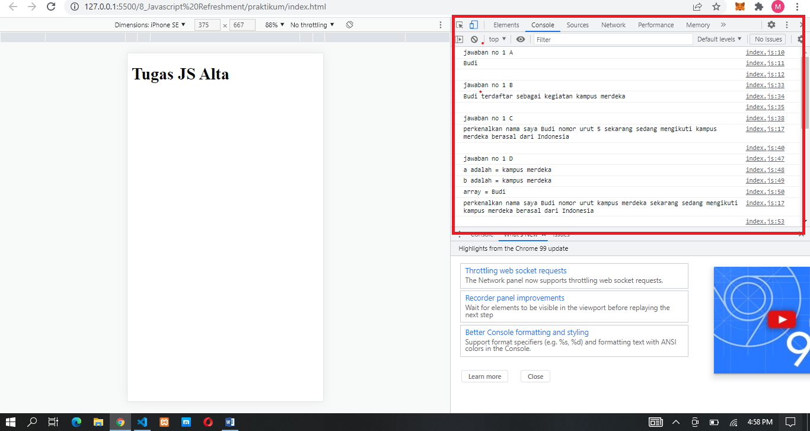
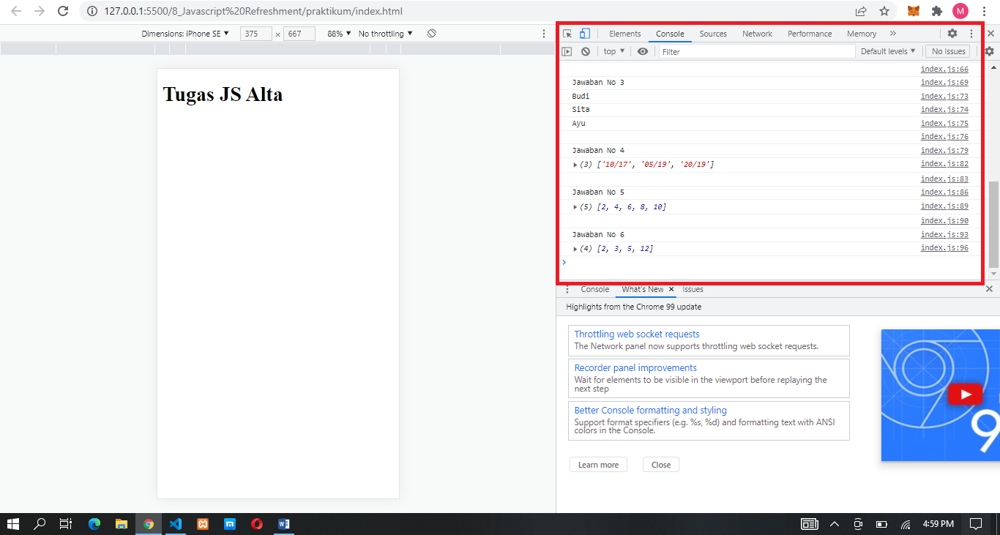

### Jawaban No 1

### Jawaban No 2

A. karena varibel terdaftar sebelumnya dideklarasikan menjadi false  
B. karena deklarasinya const nama, const tidak dapat diubah valuenya atau reassignment  
C. Tidak karena asal berada didalam scope lokal di function perkenalan

### Jawaban No 3 - 6

